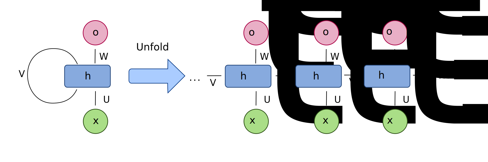
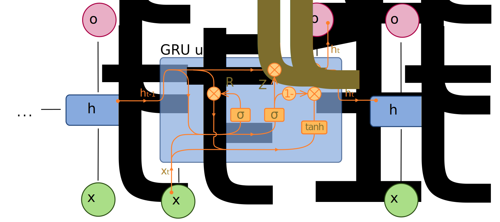
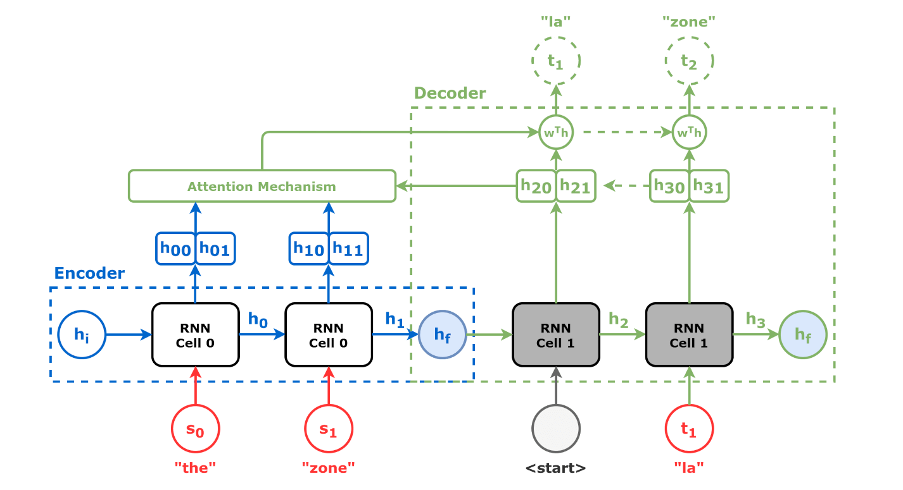
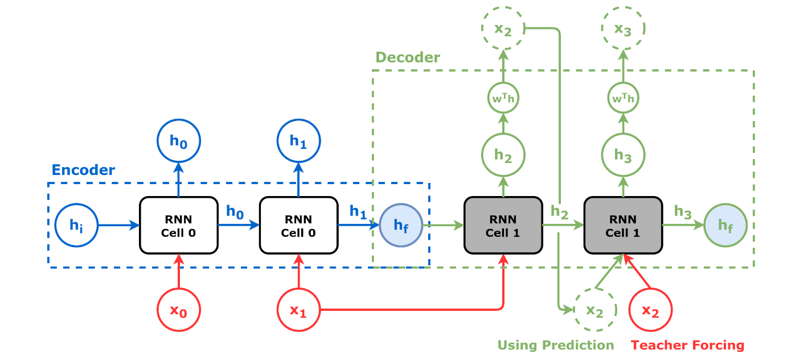

# Рекуррентные нейронные сети: единая теория SimpleRNN, LSTM и GRU

## 1. Назначение рекуррентных сетей

Рекуррентные сети применяются в задачах, где важен порядок элементов:
- текст и токены;
- временные ряды;
- аудиосигналы;
- цепочки событий.

Ключевая идея: на шаге времени $t$ модель получает текущий вход $x_t$ и внутреннюю память из прошлого шага.

## 2. Почему эти архитектуры появились именно так

### 2.1 От полносвязных сетей к RNN

Полносвязная сеть без рекурсии обрабатывает каждый объект независимо и не хранит состояние между шагами. Для последовательностей это неудобно: приходится вручную кодировать историю фиксированным окном.

RNN добавила рекуррентную память $h_t$, которая обновляется на каждом шаге и переносит контекст дальше по времени.

### 2.2 Почему одного скрытого состояния оказалось недостаточно

У обычной RNN градиент проходит через длинную цепочку одинаковых преобразований. На длинных последовательностях это приводит к:
- затухающим градиентам (модель забывает дальний контекст);
- взрывающимся градиентам (неустойчивое обучение).

### 2.3 Почему LSTM выглядит как система ворот

`LSTM` (`Long Short-Term Memory`) разделяет:
- долговременную память $c_t$;
- внешнее скрытое состояние $h_t$.

Ворота (`forget`, `input`, `output`) были введены как управляемые коэффициенты в диапазоне $(0,1)$, чтобы модель могла отдельно решать:
- что забывать;
- что записывать в память;
- какую часть памяти показывать наружу.

### 2.4 Почему GRU упростила LSTM

`GRU` (`Gated Recurrent Unit`) сохранила идею управляемого потока информации, но уменьшила число механизмов:
- нет отдельного канала $c_t$;
- меньше ворот;
- часто выше скорость обучения и инференса при сопоставимом качестве на средних по сложности задачах.

### 2.5 Почему появился seq2seq

Во многих прикладных задачах длина входа и длина выхода различаются (перевод, транслитерация, нормализация). Поэтому возникла схема `encoder-decoder` (`seq2seq`):
- encoder кодирует входную последовательность;
- decoder порождает выходную последовательность по шагам.

## 3. Форматы последовательных задач

### 3.1 `many-to-one`

Интуиция: вся последовательность дает один итоговый ответ.

$$
(x_1,\dots,x_T) \rightarrow \hat{y}
$$

Типовые формы тензоров:
- $X \in \mathbb{R}^{N\times T\times d_x}$;
- $y \in \mathbb{R}^{N}$ или $\mathbb{R}^{N\times d_y}$.

Вычислительно: используется финальное состояние $h_T$.

### 3.2 `many-to-many` (синхронный)

Интуиция: на каждом шаге требуется ответ той же временной позиции.

$$
(x_1,\dots,x_T) \rightarrow (\hat{y}_1,\dots,\hat{y}_T)
$$

Типовые формы тензоров:
- $X \in \mathbb{R}^{N\times T\times d_x}$;
- $y \in \mathbb{R}^{N\times T}$ или $\mathbb{R}^{N\times T\times d_y}$.

Вычислительно: используется каждый $h_t$ (`return_sequences=True`).

### 3.3 `seq2seq` (асинхронный many-to-many)

Интуиция: вход и выход имеют разные длины.

$$
(x_1,\dots,x_{T_{in}}) \rightarrow (\hat{y}_1,\dots,\hat{y}_{T_{out}})
$$

Типовые формы тензоров:
- `encoder_input`: $(N,T_{in})$ или $(N,T_{in},d_x)$;
- `decoder_input`: $(N,T_{out})$;
- `decoder_target`: $(N,T_{out})$ или $(N,T_{out},1)$.

На обучении часто применяется `teacher forcing`: на вход decoder на шаге $t$ подается истинный токен с шага $t-1$.

### 3.4 Связь форматов с типом ячейки

Формат (`many-to-one`, `many-to-many`, `seq2seq`) задает схему входов/выходов во времени. Тип ячейки (`SimpleRNN`, `LSTM`, `GRU`) задает внутреннее обновление памяти. Это независимые уровни проектирования.

## 4. Канонический блок обозначений и формул

Этот раздел является единственным источником формул. Ниже по документу формулы не дублируются.

### 4.1 Базовые обозначения

- $x_t \in \mathbb{R}^{d_x}$: вход на шаге $t$.
- $h_t \in \mathbb{R}^{d_h}$: скрытое состояние.
- $c_t \in \mathbb{R}^{d_h}$: память LSTM.
- $s_t \in \mathbb{R}^{d_y}$: логиты (scores) выходного слоя.
- $\hat{y}_t$: предсказание после выходной активации.
- $y_t$: истинная метка.
- $\odot$: поэлементное умножение.
- $[a;b]$: конкатенация.

Инициализация:
- `SimpleRNN`, `GRU`: $h_0$ (обычно нулевой, реже обучаемый);
- `LSTM`: $h_0, c_0$ (обычно нулевые).

### 4.2 Размерности параметров

`SimpleRNN`:
- $W_{xh}\in\mathbb{R}^{d_h\times d_x}$,
- $W_{hh}\in\mathbb{R}^{d_h\times d_h}$,
- $W_{hy}\in\mathbb{R}^{d_y\times d_h}$,
- $b_h\in\mathbb{R}^{d_h}$,
- $b_y\in\mathbb{R}^{d_y}$.

`LSTM` и `GRU` используют объединенный вход:

$$
u_t=[h_{t-1};x_t] \in \mathbb{R}^{d_h+d_x}
$$

Для каждого воротного/кандидатного преобразования матрица имеет форму
$W_*\in\mathbb{R}^{d_h\times(d_h+d_x)}$, смещение $b_*\in\mathbb{R}^{d_h}$.

### 4.3 Forward: `SimpleRNN`

$$
a_t = W_{xh}x_t + W_{hh}h_{t-1} + b_h
$$

$$
h_t = \tanh(a_t)
$$

$$
s_t = W_{hy}h_t + b_y, \quad \hat{y}_t = g(s_t)
$$

### 4.4 Forward: `LSTM`

$$
f_t = \sigma(W_f u_t + b_f)
$$

$$
i_t = \sigma(W_i u_t + b_i)
$$

$$
\tilde{c}_t = \tanh(W_c u_t + b_c)
$$

$$
o_t = \sigma(W_o u_t + b_o)
$$

$$
c_t = f_t \odot c_{t-1} + i_t \odot \tilde{c}_t
$$

$$
h_t = o_t \odot \tanh(c_t)
$$

### 4.5 Forward: `GRU`

$$
z_t = \sigma(W_z u_t + b_z)
$$

$$
r_t = \sigma(W_r u_t + b_r)
$$

$$
\tilde{h}_t = \tanh\left(W_h[r_t\odot h_{t-1};x_t] + b_h\right)
$$

$$
h_t = (1-z_t)\odot h_{t-1} + z_t\odot \tilde{h}_t
$$

Принятая конвенция фиксирована в этой записи; эквивалентная альтернативная запись получается переобозначением ворот.

### 4.6 Выходной слой для разных форматов

`many-to-one`:

$$
s = W_{hy}h_T + b_y, \quad \hat{y}=g(s)
$$

`many-to-many`:

$$
s_t = W_{hy}h_t + b_y, \quad \hat{y}_t=g(s_t), \ t=1,\dots,T
$$

`seq2seq` (encoder-decoder):

$$
h_t^{enc}=f_{enc}(x_t,h_{t-1}^{enc}), \quad c_{enc}=h_{T_{in}}^{enc}
$$

$$
h_t^{dec}=f_{dec}(E(y_{t-1}^{in}),h_{t-1}^{dec},c_{enc})
$$

$$
s_t^{dec}=W_{out}h_t^{dec}+b_{out}, \quad \hat{y}_t=\mathrm{softmax}(s_t^{dec})
$$

### 4.7 Функции потерь

Бинарная классификация:

$$
\mathcal{L}_{BCE} = -\left[y\log\hat{y} + (1-y)\log(1-\hat{y})\right]
$$

Многоклассовая классификация по индексам классов:

$$
\mathcal{L}_{SCE} = -\log p_y
$$

### 4.8 BPTT и стабильность градиентов

Суммарная потеря по времени:

$$
\mathcal{L}=\sum_{t=1}^{T}\ell_t
$$

Передача чувствительности через время:

$$
\frac{\partial h_t}{\partial h_{t-k}}=
\prod_{j=t-k+1}^{t}\frac{\partial h_j}{\partial h_{j-1}}
$$

Градиент по параметру $\theta$:

$$
\frac{\partial \mathcal{L}}{\partial \theta}=
\sum_{t=1}^{T}\sum_{k=1}^{t}
\frac{\partial \ell_t}{\partial h_t}
\frac{\partial h_t}{\partial h_k}
\frac{\partial h_k}{\partial \theta}
$$

Truncated BPTT с окном $K$:

$$
\frac{\partial \mathcal{L}}{\partial \theta}
\approx
\sum_{t=1}^{T}\sum_{k=\max(1,t-K+1)}^{t}
\frac{\partial \ell_t}{\partial h_t}
\frac{\partial h_t}{\partial h_k}
\frac{\partial h_k}{\partial \theta}
$$

Gradient clipping:

$$
g \leftarrow g\cdot\min\left(1,\frac{\tau}{\|g\|_2}\right)
$$

## 5. Как форматы задач реализуются вычислительно в SimpleRNN/LSTM/GRU

| Формат | Что делает ячейка | Что идет в выходной слой | Ключевая настройка |
|---|---|---|---|
| `many-to-one` | обновляет состояние на каждом шаге | только финальное состояние $h_T$ | `return_sequences=False` |
| `many-to-many` | обновляет состояние на каждом шаге | все состояния $h_1,\dots,h_T$ | `return_sequences=True` |
| `seq2seq` | encoder строит контекст, decoder порождает выход | состояния decoder на каждом шаге | два входа: `encoder_input`, `decoder_input` |

При замене `SimpleRNN` на `LSTM` или `GRU` меняется только правило обновления внутреннего состояния, но логика формата задачи сохраняется.

## 6. Интернет-инфографика и ее чтение

### 6.1 Развертка RNN по времени

Что изображено:
- одна рекуррентная ячейка, развернутая на шаги $1,\dots,T$;
- зависимость каждого $h_t$ от $x_t$ и $h_{t-1}$.

Как читать стрелки:
- горизонтальные стрелки: перенос памяти по времени;
- вертикальные стрелки: входы и выходы текущего шага.

Какие символы на схеме:
- $x_t$, $h_t$, $y_t$ (или эквивалентные обозначения выхода).

Какая формула соответствует:
- раздел 4.3 (`SimpleRNN`) и раздел 4.6 (`many-to-many`/`many-to-one`).

Типичная ошибка чтения:
- считать каждый блок независимой сетью. На самом деле это один и тот же набор параметров, переиспользуемый на всех шагах.

### 6.2 Ячейка LSTM

Что изображено:
- внутренний канал памяти $c_t$;
- три воротных коэффициента: $f_t$, $i_t$, $o_t$;
- кандидат памяти $\tilde{c}_t$.

Как читать стрелки:
- верхняя «магистраль» показывает эволюцию $c_t$;
- боковые ветви через $\sigma$ управляют долями забывания, записи и чтения.

Какие символы на схеме:
- $x_t$, $h_{t-1}$, $c_{t-1}$, $f_t$, $i_t$, $\tilde{c}_t$, $o_t$, $c_t$, $h_t$.

Какая формула соответствует:
- раздел 4.4.

Типичная ошибка чтения:
- трактовать $o_t$ как логиты модели. В этой теории $o_t$ используется только как output gate LSTM; логиты обозначаются $s_t$.

### 6.3 Ячейка GRU

Что изображено:
- ворота обновления $z_t$ и сброса $r_t$;
- кандидат состояния $\tilde{h}_t$;
- смешивание старого и нового состояния в $h_t$.

Как читать стрелки:
- ветка через $r_t$ регулирует вклад прошлого в кандидата;
- ветка через $z_t$ задает баланс между $h_{t-1}$ и $\tilde{h}_t$.

Какие символы на схеме:
- $x_t$, $h_{t-1}$, $z_t$, $r_t$, $\tilde{h}_t$, $h_t$.

Какая формула соответствует:
- раздел 4.5.

Типичная ошибка чтения:
- менять местами коэффициенты у $h_{t-1}$ и $\tilde{h}_t$. В канонической записи используется формула из раздела 4.5.

### 6.4 Seq2seq: обучение (teacher forcing)

Что изображено:
- encoder читает входную последовательность;
- decoder получает предыдущий истинный токен и предсказывает следующий.

Как читать стрелки:
- слева направо по encoder: формирование контекста;
- в decoder вход шага $t$ связан с истинным токеном шага $t-1$.

Какие символы на схеме:
- `encoder_input`, `decoder_input`, предсказания decoder по шагам.

Какая формула соответствует:
- раздел 4.6 (`seq2seq`) с `teacher forcing`.

Типичная ошибка чтения:
- подавать в decoder только предсказанные токены уже на обучении, что ухудшает стабильность ранних эпох.

### 6.5 Seq2seq: обучение и инференс

Что изображено:
- сравнение двух режимов: `teacher forcing` на обучении и автогенерация на инференсе.

Как читать стрелки:
- в обучении на вход decoder идет истинный прошлый токен;
- на инференсе на вход decoder идет собственное прошлое предсказание.

Какие символы на схеме:
- вход encoder, шаги decoder, выходные токены, переход от `start` к `EOS`.

Какая формула соответствует:
- раздел 4.6 (`seq2seq`) и правило генерации по шагам.

Типичная ошибка чтения:
- считать, что инференс повторяет тренировочный поток входов один в один.

### 6.6 Таблица соответствия символов: инфографика -> теория

| Символ на рисунках | Канонический символ в теории | Смысл |
|---|---|---|
| $h_t$, $h_{t-1}$ | $h_t$, $h_{t-1}$ | скрытое состояние |
| $C_t$, $C_{t-1}$ или $c_t$, $c_{t-1}$ | $c_t$, $c_{t-1}$ | память LSTM |
| $y_t$, $\hat{y}_t$ | $\hat{y}_t$ | предсказание |
| pre-activation / score / logits | $s_t$ | логиты до `sigmoid`/`softmax` |
| candidate state | $\tilde{c}_t$ или $\tilde{h}_t$ | кандидат обновления памяти |
| update gate | $z_t$ | баланс старого и нового состояния (GRU) |
| reset gate | $r_t$ | вклад прошлого в кандидата (GRU) |
| forget/input/output gates | $f_t$, $i_t$, $o_t$ | управление памятью (LSTM) |

## 7. Краткие численные мини-примеры forward

### 7.1 `SimpleRNN`

Пусть на шаге $t$ получено $a_t=0.8$. Тогда:

$$
h_t=\tanh(0.8)\approx 0.664
$$

Если далее $s_t=1.2$, то для бинарной задачи:

$$
\hat{y}_t=\sigma(1.2)\approx 0.768
$$

### 7.2 `LSTM`

Пусть $f_t=0.9$, $i_t=0.2$, $c_{t-1}=0.7$, $\tilde{c}_t=0.5$. Тогда:

$$
c_t=0.9\cdot 0.7 + 0.2\cdot 0.5 = 0.73
$$

Если $o_t=0.6$, то

$$
h_t=0.6\cdot\tanh(0.73)\approx 0.374
$$

### 7.3 `GRU`

Пусть $z_t=0.3$, $h_{t-1}=0.8$, $\tilde{h}_t=0.2$. Тогда:

$$
h_t=(1-0.3)\cdot 0.8 + 0.3\cdot 0.2 = 0.62
$$

Интерпретация: состояние остается ближе к прошлому, потому что $z_t$ мало.

## 8. Backpropagation Through Time (BPTT): компактно и полно

### 8.1 Что именно оптимизируется

Градиент считается для общих во времени параметров. Поэтому вклад в $\frac{\partial \mathcal{L}}{\partial \theta}$ суммируется от всех шагов.

### 8.2 Локальный якобиан для SimpleRNN

Из раздела 4.3:

$$
h_t=\tanh(W_{xh}x_t+W_{hh}h_{t-1}+b_h)
$$

Локальная производная по прошлому состоянию:

$$
\frac{\partial h_t}{\partial h_{t-1}}=
\mathrm{diag}(1-h_t^2)\,W_{hh}
$$

Именно произведение таких множителей по времени порождает затухание/взрыв градиента.

### 8.3 Практический алгоритм truncated BPTT

1. Разбить длинную последовательность на окна длины $K$.
2. Выполнить forward на текущем окне и накопить потери.
3. Выполнить backward только внутри окна.
4. Обновить параметры оптимизатором.
5. Перейти к следующему окну, передав финальное состояние как начальное (по выбранной политике detach/reset).

### 8.4 Почему gated-архитектуры обычно устойчивее

- В LSTM канал $c_t$ содержит аддитивный путь, который облегчает перенос градиента на дальние шаги.
- В GRU ворота динамически регулируют, сколько старой информации сохранить, уменьшая риск разрушения полезного сигнала.
- Даже с gated-ячейками на практике часто применяются `truncated BPTT` и `gradient clipping`.

## 9. Словарь терминов

### 9.1 Данные и структура

- `sequence`: упорядоченный набор элементов $x_1,\dots,x_T$.
- `time step`: позиция $t$ внутри последовательности.
- `feature`: компонент входного вектора на шаге времени.
- `padding`: добавление служебных значений для выравнивания длины.
- `mask`: индикатор значимых позиций (например, без PAD).

### 9.2 Состояния и блоки

- `hidden state` ($h_t$): краткосрочное представление контекста.
- `cell state` ($c_t$): долговременный канал памяти LSTM.
- `gate`: коэффициент управления потоком информации.
- `candidate state` ($\tilde{h}_t$, $\tilde{c}_t$): кандидат обновления состояния.

### 9.3 Выходы и функции активации

- `logit/score` ($s_t$): линейный выход до вероятности.
- `probability`: результат после `sigmoid`/`softmax`.
- `sigmoid`: активация в диапазоне $(0,1)$.
- `tanh`: активация в диапазоне $[-1,1]$.
- `softmax`: распределение вероятностей по классам.

### 9.4 Обучение и качество

- `loss`: функция ошибки.
- `binary cross-entropy`: потеря для бинарной классификации.
- `sparse categorical cross-entropy`: потеря для целочисленных меток классов.
- `optimizer`: правило обновления параметров.
- `learning rate`: шаг обновления.
- `epoch`: полный проход по train-набору.
- `batch`: мини-подвыборка для одного шага оптимизации.
- `train/validation/test split`: раздельные наборы для обучения, подбора и финальной оценки.
- `overfitting`: переобучение на train с потерей обобщения.
- `regularization`: методы ограничения переобучения.
- `latency`: время отклика модели на инференсе.

### 9.5 Градиенты и последовательности

- `vanishing gradients`: затухание градиента.
- `exploding gradients`: взрыв градиента.
- `BPTT`: backpropagation через время.
- `truncated BPTT`: BPTT на ограниченном окне.
- `gradient clipping`: ограничение нормы градиента.

### 9.6 Seq2seq-термины

- `teacher forcing`: подача истинного предыдущего токена в decoder.
- `token accuracy`: доля правильно предсказанных токенов.
- `sequence accuracy`: доля полностью правильных последовательностей.
- `exact match`: полное совпадение последовательности по значимым позициям.

## 10. Карта терминов: где это используется в лабораторных

| Термин | Где применяется |
|---|---|
| `many-to-one`, `h_T`, `binary_crossentropy` | ЛР1: формулировка задачи, модель, оценка |
| `many-to-many`, `return_sequences`, `token/sequence accuracy` | ЛР2: модель и метрики |
| `seq2seq`, `teacher forcing`, `exact match`, `mask` | ЛР3: генерация данных, обучение, оценка |
| `train/validation/test split` | Все ЛР: этапы обучения |
| `s_t`, `\hat{y}_t`, `loss` | Все ЛР: выходной слой и интерпретация метрик |
| `BPTT`, `truncated BPTT`, `gradient clipping` | Теория и практические рекомендации при настройке обучения |

## 11. Типичные ошибки

1. Смешивать форматы задачи и тип рекуррентной ячейки.
2. Путать $s_t$ (логиты) и $\hat{y}_t$ (вероятности/классы).
3. Интерпретировать $o_t$ вне контекста LSTM-gate.
4. Неверно задавать формы данных: порядок осей должен быть `(batch, time, features)`.
5. Нарушать сдвиг между `decoder_input` и `decoder_target` в `seq2seq`.
6. Оценивать `exact match` без маски PAD-токенов.

## 12. Чек-лист самопроверки

1. Записаны и понятны формулы разделов 4.3, 4.4, 4.5.
2. Ясно, как один и тот же формат задачи реализуется с `SimpleRNN`, `LSTM`, `GRU`.
3. Ясно, почему `many-to-many` требует `return_sequences=True`.
4. Ясно, как устроен сдвиг в `teacher forcing`.
5. Ясно, почему существуют `vanishing/exploding gradients` и когда применять `truncated BPTT` и `gradient clipping`.
6. Ясно, какие метрики подходят для `many-to-one`, `many-to-many`, `seq2seq`.

## 13. Как это выглядит в лабораторных

Ниже приведено соответствие между каноническими формулами и реальными тензорами из лабораторных заданий.

### 13.1 Лабораторная 1 (`many-to-one`, `SimpleRNN`)

Формула:

$$
h_t = \tanh(W_{xh}x_t + W_{hh}h_{t-1} + b_h), \quad
s = W_{hy}h_T + b_y, \quad
\hat{y}=\sigma(s)
$$

Практическое соответствие:
- `X_train` имеет форму `(N, T, 1)` и подается в `model.fit`;
- `y_train` имеет форму `(N,)`;
- `model.predict(X_test)` возвращает вероятности формы `(N_test, 1)`, которые преобразуются в `preds`.

### 13.2 Лабораторная 2 (`many-to-many`, `LSTM`)

Формулы перехода:

$$
u_t=[h_{t-1};x_t], \quad
f_t = \sigma(W_f u_t + b_f), \quad
i_t = \sigma(W_i u_t + b_i), \quad
\tilde{c}_t = \tanh(W_c u_t + b_c), \quad
o_t = \sigma(W_o u_t + b_o)
$$

$$
c_t = f_t \odot c_{t-1} + i_t \odot \tilde{c}_t, \quad
h_t = o_t \odot \tanh(c_t), \quad
s_t = W_{hy}h_t + b_y, \quad
\hat{y}_t = \sigma(s_t)
$$

Практическое соответствие:
- `X_train`: `(N, T, 1)`;
- `y_train`: `(N, T, 1)`;
- `return_sequences=True` обеспечивает выход формы `(batch, T, 1)`;
- дополнительно считаются `token_accuracy` и `sequence_accuracy`.

### 13.3 Лабораторная 3 (`seq2seq`, `GRU` encoder-decoder)

Формулы:

$$
h_t^{enc}=f_{enc}(x_t,h_{t-1}^{enc}), \quad c_{enc}=h_{T_{in}}^{enc}
$$

$$
h_t^{dec}=f_{dec}(E(y_{t-1}^{in}),h_{t-1}^{dec},c_{enc})
$$

$$
s_t^{dec}=W_{out}h_t^{dec}+b_{out}, \quad \hat{y}_t=\mathrm{softmax}(s_t^{dec})
$$

Практическое соответствие:
- вход `model.fit`: `[encoder_input, decoder_input]`;
- цель: `decoder_target` формы `(N, T_out, 1)`;
- выход: вероятности `(N, T_out, V)`;
- итоговая строгая метрика: `exact_match` с маской `target != PAD`.

## 14. Внутренняя логика обучения по типам ячеек

### 14.1 Общий цикл внутри эпохи

Для каждого мини-батча выполняются шаги:
1. Прямой проход (`forward pass`) по всем временным шагам.
2. Вычисление функции потерь.
3. Обратное распространение через время (`BPTT`).
4. Обновление параметров оптимизатором.

Эта схема одинакова для `SimpleRNN`, `LSTM`, `GRU`; различается только внутреннее обновление состояния.

### 14.2 `SimpleRNN`: чего ожидать на практике

- Обучение обычно быстрое на коротких зависимостях.
- При увеличении длины последовательности чаще проявляются проблемы с градиентом.
- На графиках: быстрое снижение `loss` в начале, затем возможная ранняя стагнация.

### 14.3 `LSTM`: чего ожидать на практике

- За счет отдельного канала памяти `c_t` обучение стабильнее на более длинных зависимостях.
- Чаще достигаются более устойчивые метрики в задачах с накоплением контекста.
- На графиках: более плавная динамика `val_loss`, меньшая чувствительность к длине последовательности.

### 14.4 `GRU`: чего ожидать на практике

- Обычно быстрее, чем `LSTM`, при сопоставимом качестве на задачах средней сложности.
- Подходит как компромисс между выразительностью и вычислительной стоимостью.
- В `seq2seq` особенно критичен корректный сдвиг `decoder_input` и `decoder_target`; ошибки в сдвиге резко ухудшают `exact_match`.
